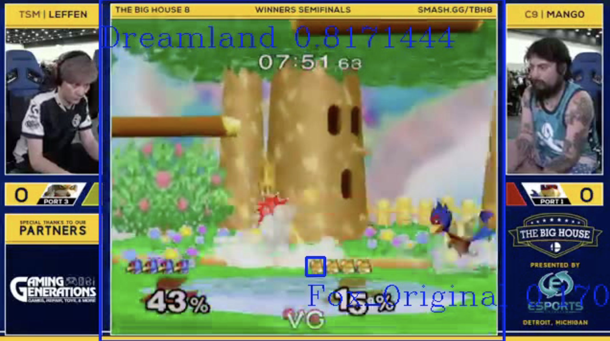

# deep-smash

Computer Vision applied to Super Smash Bros Melee for data extraction.

## Model
The model used for detection is developed using a [Keras implementation of RetinaNet](https://github.com/fizyr/keras-retinanet) by fizyr. The process of model training and inference is documented in [experiment.ipynb](https://github.com/danitello/deep-smash/blob/master/keras-retinanet/train/experiment.ipynb). The other items in the `train` folder contain resources that are used for training within the notebook. That is where most of the work that's been done can be found. It also uses the prediction scripts in the root directory including `predict_batch.py` for predicting given a set of images, `visualize_batch.py` for overlaying the predictions to an output video, and `predict_video.py` for predicting straight from a video to an output video.

To acquire data for training and testing, youtube videos can be downloaded using [download_youtube.py](https://github.com/danitello/deep-smash/blob/master/download_youtube.py) like so
```bash
python3 download_youtube.py <video_id> <file name to save> <file directory to save>
```

[This website](https://smashsight.com/welcome-to-smashsight/) has awesome data on games from Genesis 5 but unfortunately it was not found to be particularly useful (yet - I wanted to start by augmenting what they had) as explained in the notebook. It's very cool what they've done and I started off by just exploring their data and it influenced how I format this project's data.

## Improvements to make
Lots. The higher priority ones at this early stage are primarily centered around making the process more robust and adding new data points to extract (and expanding on the current ones). Right now, it is only training on a very small subset of stages and characters to detect - need to simply gather more training data. There are so many more possibilities (see References).
* More objective testing. In order to expand, must be able to experiment with clear baselines. So far, it's been somewhat qualitative out of necessity.
* Clean and organize the code, especially the relationship of the model code to the process code. Once things fit together nicer / are more automated, it will help expanding be much swifter.



Stage and character detection. With more data preparation, higher confidence will be reached, and more entities can be detected (e.g. the model hadn't been trained to find Falco yet in the above image); not to mention other useful types of data like stock count, game time, player name, character position, etc.

## References
* [SmashSight](https://smashsight.com/welcome-to-smashsight/) as mentioned earlier
* [jpnaterer/smashscan](https://github.com/jpnaterer/smashscan) did a similar, dope project using [darkflow](https://github.com/thtrieu/darkflow) that's much more built out and inspired this one
* [Object Detection On Aerial Imagery Using RetinaNet](https://towardsdatascience.com/object-detection-on-aerial-imagery-using-retinanet-626130ba2203) was a great resource on using RetinaNet, and a cool project
